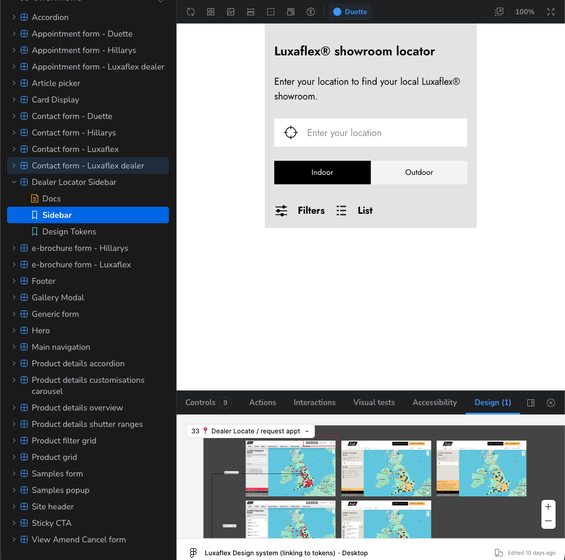

This is a guide to embedding Figma designs in Storybook. It is intended for **designers and developers**.

[The Designs addon for Storybook](https://storybook.js.org/addons/@storybook/addon-designs) lets you place a live Figma frame alongside a story, so you can compare implementation against design pixel-for-pixel.

## Setup

```sh
npm install --save-dev storybook-addon-designs
```

Register it in `.storybook/main.ts`:

```ts
export default {
  addons: ['storybook-addon-designs'],
};
```

## Usage

Add a design parameter to an individual story, pointing at the Figma frame URL:

```tsx
export const Primary: Story = {
  args: { variant: 'primary', children: 'Click me' },
  parameters: {
    design: {
      type: 'figma',
      url: 'https://www.figma.com/file/abc123/Design-System?node-id=1%3A2',
    },
  },
};
```

Or add a design parameter to the component meta:

```tsx
const meta: Meta<TButton> = {
  title: 'atoms/Button',
  parameters: {
  layout: 'fullscreen',
  design: [
    {
      name: 'Figma: Button',
      type: 'figma',
      url: 'https://www.figma.com/file/abc123/Design-System?node-id=1%3A2',
      },
    ],
  },
};
```

:::note[What this does in Storybook]
On an individual component story (not a Docs story), in the Addons panel, you'll see a new tab titled "Design". Clicking this tab will render the linked Figma frame directly in the panel. You can zoom in and move around, but you can't make edits from here.

It's particularly useful during implementation review: a reviewer can toggle between the built component and the design without leaving the browser tab, and designers can leave comments in Figma that stay linked to the exact component they refer to.


:::

## Best practices

- You may add as many links to Figma frames as you like, but use your best judgement. If a frame contains designs for all states of the component, add it to the `meta`. If a frame contains a design that's only relevant to one state of the component, add it to the individual story.

## Further reading

- [Storybook: Design integrations](https://storybook.js.org/docs/sharing/design-integrations#figma)