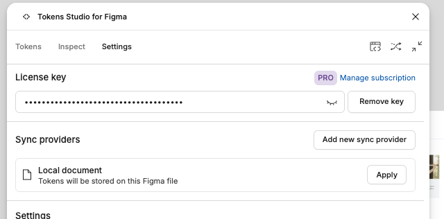
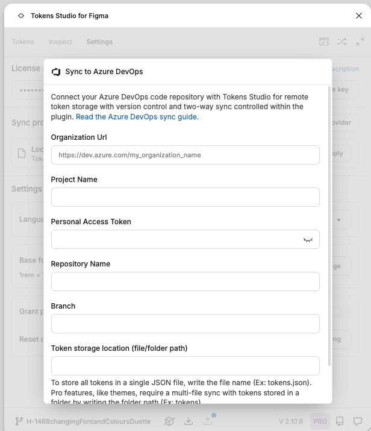

This guide explains how to get started with Tokens Studio for Figma, including installation and connecting to Azure DevOps. It is intended for **designers**.

## Before you begin

This guide requires you to have the following information to hand:

- a Tokens Studio Pro licence key
- an Azure PAT (personal access token)
- your project's:
  - organisational URL
  - name
  - repository name
  - design tokens directory

## 1. Install the plugin

1. Open the Tokens Studio plugin page in the Figma Community.
2. Select the ribbon icon to save the plugin to your Figma account.
3. Open any Figma file, then launch the plugin — either through the quick actions menu (`Cmd/Ctrl + P`, then search "Tokens Studio") or via the Plugins menu.

## 2. Connect Azure DevOps as your sync provider

1. Open the plugin settings.
2. Under "Sync providers", select "Add new sync provider".

3. Choose Azure DevOps. You'll see a new panel of settings, entitled "Sync to Azure DevOps".

4. Fill out the fields, using the required information above. Under "Branch", enter "main".
5. Once connected, look at the bottom of the plugin panel for the Sync Actions bar. You'll see the current branch name, `main`, displayed there.
