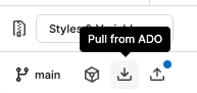
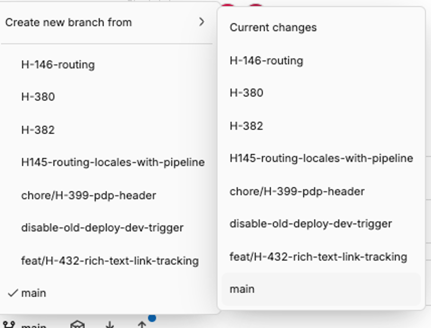
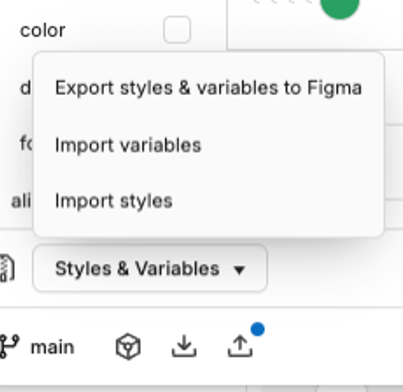
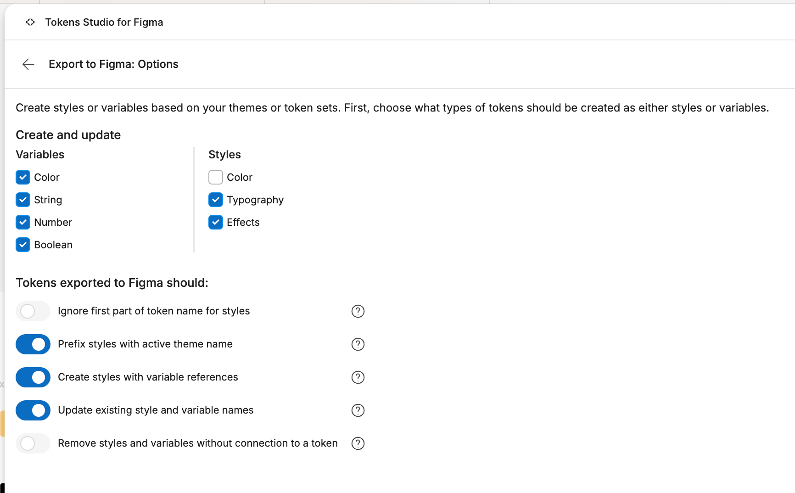

This guide explains branch management in Tokens Studio for Figma. It is intended for **designers**.

## Before you begin

It is **not required** for you to know about version control or branching strategies for the purposes of this guide.

The important thing to remember is that `main` is the single source of truth for the app, and that a branch contains new code that contributes to `main`.

## Creating a branch

A branch exists for a specific piece of work. A good rule of thumb is to create a new branch for each ticket.

1. In Figma, launch the Tokens Studio for Figma plugin.
2. Ensure that the `main` branch is selected in the Sync Actions bar.
3. Click **Pull from ADO**.

4. Choose **Create new branch from**.
5. Select `main` from the menu.

6. Name your branch, using either camelCase or kebab-case, the ticket number, and a brief description of the work, usually no more than 3 words.

:::note[Examples of branch names]

- `T-1234-newFeature`
- `X-789-brand-new-idea`

:::

If you have unsynced changes whilst creating a new branch (shown as a blue push indicator), Tokens Studio will prompt you to push them first so nothing is lost.

## A branch's lifecycle

1. Once you've created your branch, make changes to your tokens and push them up regularly, using the **Push to ADO** button in the Sync Actions bar.
2. When your work is ready for review, let one of the devs on your team know. They will:
  - Pull your branch onto their machine
  - Check that the app builds correctly with your new tokens
  - Open a pull request on your behalf
  - Merge your branch to main once the PR is approved
3. Whilst your branch is under review, you can create a new branch for your next ticket. Be sure to create the ticket from `main`, and not your unmerged branch.

:::caution[Help! I got a warning about overriding my tokens when I created a branch!]
Token Studio will warn you that the new branch will override the tokens from your unmerged branch. **THIS IS EXPECTED AND OK.**

These tokens will reappear in `main` after developers complete the pull request, so you'll see them on your next pull from `main`.

It's useful to copy the tokens created from the "Diff" tab of your unmerged branch, and add them to the ticket as a backup, just in case you need to re-apply them before your branch is merged.
:::

## Exporting styles to Figma

1. Once your branch has been merged, select `main` and click **Pull from ADO**.
2. Select **Styles & Variables** from the dropdown, then select **Export styles & variables to Figma** from the menu.

3: Apply the following options:
  - Create and update variables: color, string, number, boolean
  - Create and update styles: typography, effects (NOT color)
  - Ignore first part of token name for styles OFF
  - Prefix styles with active theme name ON
  - Create styles with variable references ON
  - Update existing style and variable names ON
  - Remove styles and variables without connection to a token OFF

:::caution[Recovering changes after a restart]
If Figma closes or restarts, reopen Token Studio and click **Recover Local Changes**. You may need to reselect your branch.
:::
